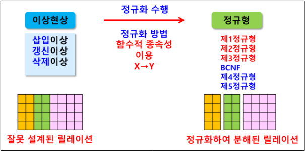
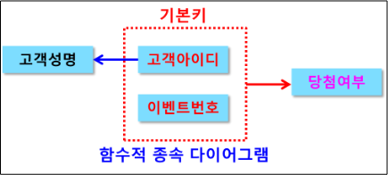
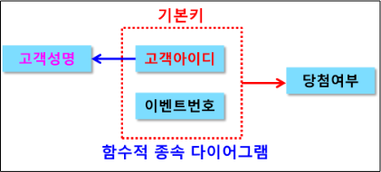
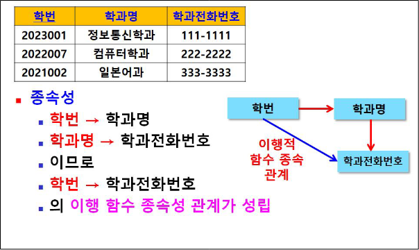

## 정규화 정리 

  > 이상현상을 야기하는 Attribute간의 종속관계를 제거하기 위해   
  릴레이션을 여러 작은 릴레이션으로 분해하는 과정  
  
  


  > 이상 현상이란 ?
  ```
    불필욯나 데이터 중복으로 인해 릴레이션에 대한 데이터 삽입/수정/삭제  
    연산을 수행할 때 발생할 수 있는 부작용
  ```

  * 이상현상의 유형  
      * 삽입 이상 : 새 데이터 삽입 시 불필요한 데이터가 같이 삽입되는 경우 
      * 갱신 이상 : 속성값 갱신 시 일부만 갱신되어 데이터 불일치가 발생하는 경우
      * 삭제 이상 : 한 튜플 삭제 시 유지되어야 할 다른 정보도 연쇄 삭제되는 경우

  > 이를 해결하기 위해 정규화 실행   
  > 정규화는 함수적 종속성을 이용하여 수행한다 

  > 함수적 종속성이란 ?
  ```
    테이블의 속성들이 어떤 기준값에 의해 종속되는 현상을 말한다
    예를 들어 학생 정보 테이블이 있다면 기본키인 학번에 학년, 성명 등이 종속되어 있다.
    이런 함수적 종속성을 바탕으로 릴레이션이 연관성이 있는 속성들로만 
    구성되도록 하여 이상 현상이 발생하지 않도록 하는 작업이 정규화이다.
  ```

  > 함수적 종속성 표현법
  ```
    릴레이션 R에서 속성들의 부분집합 X와 Y에 대해 
    X → Y 인 경우 X:결정자, Y:종속자라고 할 수 있다.
    이는 X값을 가지고 있으면 Y값 또한 구할수 있다는 의미이다.
  ```

  * 함수 종속성의 종류  
    * 완전 함수 종속(Full Functional Dependency)
        - 릴레이션에서 속성 집합 Y가 속성 집합 X에 함수적으로 종속되어 있지만  
          속성 집합 X의 일부분에는 종속되어 있지 않은 경우의 종속  
          EX)

          

        - 당첨여부는 {고객아이디, 이벤트번호} 에 완전 종속
    
    * 부분 함수 종속(Partial Functional Dependency)
        - 릴레이션에서 속성 집합 Y가 속성 집합 X의 전체가 아닌 일부분에  
          함수적으로 종속되어 있는 경우  
          EX)

          

        - 고객성명은 {고객아이디, 이벤트번호}에 부분 함수 종속
    
    * 이행적 함수 종속성
        - 한 릴레이션의 속성 X, Y, Z가 주어졌을 때 함수적 종속성 X → Y, Y → Z가  
          성립된다면, 논리적 결과로 X → Z가 성립된다. 이때 'Z는 X에 이행함수 종속된다고 할 수 있다.   
          EX)

          


> 정규화의 필요성  
```
    저장공간을 최소화, 자료간의 불일치성을 최소화, 자료구조의 안정성 최대화,
    자료의 삽입, 갱신 및 삭제에 따른 이상현상 제거
```

> 정규화의 단점
```
    여러 테이블로 분리했기 때문에 데이터 처리시 테이블간 조인이 필요  
    과한 조인 작업으로 인해 성능 저하 문제가 발생할 수 있음
```
 