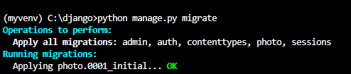
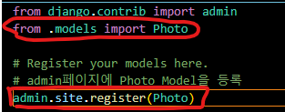
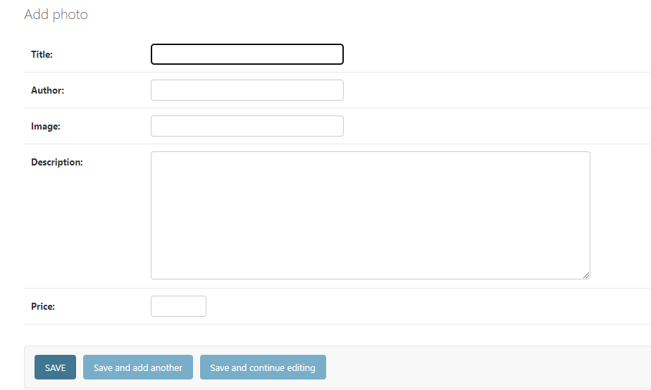

# Django 시작해보기(window) day 2

## 1. MTV 패턴 알아보기

> 어제 만든 프로젝트인 photo폴더를 보면 6개의 파이썬 파일, 그리고 migration 폴더 확인 가능  
> 이것들이 무슨 역할을 하는지 알아보자

1. Model 
  - 앱의 데이터와 관련된 부분을 총괄
  - 모델의 각 속성은 DB 필드를 의미
  - Django.db의 models => Django의 데이터베이스와 관련된 내용을 미리 작성해놓은 도구  
  - 코드 작성할때 상속받아서 기능을 사용(Models.py)
  - 많이 사용하는 필드 종류
```
CharField : 문자열(길이지정 필요 max_length={} )
IntegerField : 정수
TextField : 문자열(길이지정 필요없음)
DateField : 날짜
DateTimeField : 날짜 + 시간
FileField : 파일
ImageField : 이미지 파일
ForeignKey : 외래키
OneToOneField : 1:1관계
ManyToManyField : 다대다 관계
```
### Models.py Sample
```
from django.db import models

# Create your models here.
class Photo(models.Model):
    # models에 미리 정의되어 있는 필드 설정을 가져다가 사용
    title = models.CharField(max_length=50)
    author = models.CharField(max_length=50)
    image = models.CharField(max_length=200)
    description = models.TextField()
    price = models.IntegerField()
```
  - migration : 모델을 데이터베이스에 적용시키는 과정
  - 모델에 변화가 있을때마다 migration을 통해 프로젝트에 모델의 변경 사항을 적용해주어야 함
  - Models.py 작성 후 코드 실행
```
python manage.py makemigrations
```
  - 코드를 실행하면 Photo Moldel 생성됐다는 메세지 출력, photo/migrations 폴더에 0001_initial.py file 생성
  - 0001_initial.py를 확인해보면 Migration class 안에 migrations.CreateModel에
  내가 작성한 Model내용이 있는것을 확인 가능
```
python manage.py migrate
```
  - 이후 위 명령어를 입력하면 정상 적용되었을시 아래처럼 0001_initial...OK 출력
   
  
  
### 모델 추가하기
  - Admin.py에 가보면 #Register your models here이라는 메세지를 확인 가능  
  - 아까 만들었던 Photo라는 모델을 import 해준 후에 Photo 모델을 등록  
  
  

  - 서버 시작한 후에 admin page 들어가보면 PHOTO 확인 가능
  - photos를 클릭하여 이동한 후 오른쪽 위의 ADD PHOTO 클릭
  - 이전에 Model에서 정의한 사진모델을 확인 가능 (Title, Author, image, Desc, Price)

  

2. Template
  - 사용자에게 보이는 부분 담당 (HTML)
  - Django의 템플릿은 일반적 HTML과 99% 동일, 한가지 다른점은 탬플릿 태그
  - 탬플릿 태그는 HTML이 Python코드에서 데이터를 바로 입력받아 처리할 수 있는 도구
  - HTML만으로는 데이터를 제어할수 없어 js, jquery등을 사용해야하는데 Django에서는 바로 처리 가능
  - {} 중괄호 안에 작성, 안에 들어가는 내용은 데이터, for, if등의 구문도 가능

3. View
  - Model과 Template의 사이에서 데이터를 전달하고 Template에서 발생하는 이벤트 처리
  - 코드에서 제일 많은 비중을 차지함
