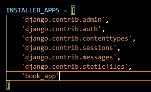

# Django 시작해보기(window) day 3

## Django CRUD 프로젝트 만들어보기 - 프로젝트 기초 세팅
> 가상환경 venv를 활성화
```
.\venv\Scripts\activate 실행 
(생성한 가상환경명)\Scripts\activete
```

> 프로젝트 생성
```
django-admin startproject book_project
```

> app 생성
```
cd book_project  

python manage.py startapp book_app
```

> app 등록
```
settings.py
INSTALLED_APPS에 book_app 추가
```


> template 폴더에 공통 사용 html 생성
```
프로젝트 바로아래 templates폴더를 생성하고
navitaion_bar.html, base.html 두개 파일 생성
프로젝트 전체에서 공통으로 사용할 템플릿
settings.py에 TEMPLATES 변수에 내용 추가
```


> 1. navication_bar.html   
> 전체 페이지 공통으로 사용할 메뉴바


> 2. base.html  
> 전체 페이지 공통으로 사용할 배경 html  
> html코드 반복을 줄이기 위한 사용    
> 전체 홈페이지에서 사용할 css파일을 한번등록으로 전체 페이지 적용


> index.html 작성
```
base.html extend 하여 간단하게 작성 가능
앞으로 작성하는 모든 html에서는 block안에 들어가는 부분만 작성하면 되어서 간편
```


> DB 접속 정보 파일 생성
```
book_project 바로 아래에 db_sessions.py 생성
기본으로 생성되어 있는 sqllite4가 아닌 mysql을 사용하기 위해 따로 세팅이 필요
```


> DB 정상 연결 확인
```
manage.py가 있는 위치에서 실행
아래 명령어를 실행하면 해당 위치 테이블의 정보를 읽어 Models.py에 들어갈 코드를 생성
python manage.py inspectdb 

```


> Models.py 작성
```
사용할 메인 테이블인 book테이블과 book.pubNo를 pk로 가진 publisher테이블 두 클래스 
위의 출력된 코드를 book_app의 Models.py에 넣어주면 완료
```

> Model이 변경되면 migration 필수적으로 migration 실행
```
python manage.py makemigrations
이상없이 완료되면
python manage.py migrate
```


> Url 추가 
```
1. book_project/urls.py
전체 프로젝트 관리용 urls.py
urlpatters에 book_app.urls추가 
include import 필요
```


```
2. book_project/book_app/urls.py
app별로 urls관리용
여기는 프로젝트 최초 생성시에 urls.py가 없으므로 생성 필요 
생성 후 index페이지 추가
```


> views.py에 index 함수 추가
```
request를 받아서 index페이지를 리턴해준다.
```


> 정상적으로 실행되는지 확인
```
python manage.py runserver
위에서 작성한 index.html페이지의 내용이 나오면 성공 !
```

## Django CRUD 프로젝트 만들어보기 - 전체 도서 조회
> 도서조회 html파일 생성
```
index.html과 동일하게 block 내에 필요한 내용을 작성
Model에 있는 변수목록과 동일하게 보여주도록 생성
views.py에서 데이터를 받아서 전체를 테이블에 보여주는 페이지
주의할점은 for문내에서 book.bookno를 받아올때 실제 테이블 컬럼명이 아닌  
Model테이블의 변수명으로 받아온다는 점이다.  
본래 테이블에는 출판사명이지만 보기좋게 출판사명으로 수정했다.
```


> views.py에 book_list select 해오는 부분 작성   


```
전체 데이터 셀렉트해 books에 넣어준다.
쿼리와 다르다고 생각하면 다른점인데 Model에 book과 publisher를 같이 만들어  
놓았더니 books안에 관련 publisher내용도 같이 조회되어서 왔다.
그래서 book.pubno.pubname을 사용하여 출판사명을 출력 가능하다.
```

> urls.py에 생성한 화면 추가
```
book_app 아래에 있는 urls.py를 열어 urlpatterns 변수에  추가

path('book_list/', views.book_list, name='book_list' ),
```


> 정상적으로 데이터 조회하는지 test


