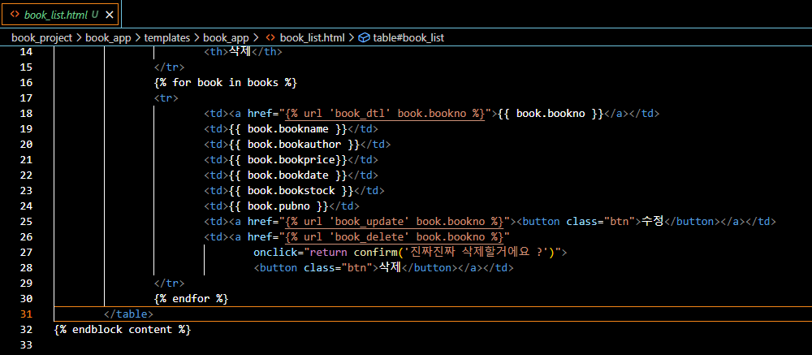

# Django 시작해보기(window) day 4

## Django CRUD 프로젝트 만들어보기 - 신규 도서 등록
> 도서 등록 html 파일 생성


```
form을 사용해서 컬럼 리스트를 정의

forms.py를 생성 후 작성
fields에 컬럼 목록을 넣어주고
label에 해당 컬럼에서 받을 값을 설명
```


> url 등록
```
urls.py에 urlpatterns에 path를 추가

path('book_form/', views.book_insert, name='book_insert'),

```

> vies.py에 insert 함수 생성


```
페이지 처음 호출되었을때는 값이 없으므로 book_form.html로 이동하고
사용자가 값을 입력 후 호출했을때는 bool_list로 redirect
```

> navigation_bar에 등록
```
<li><a href="">신규 도서 등록</a></li> 
```

> 정상적으로 데이터가 들어가는지, pk가 중복되지는 않는지 확인

## Django CRUD 프로젝트 만들어보기 - 도서 정보 업데이트
> book_update.html 생성
> boook_insert에서 사용했던 form 그대로 사용


> url 등록
```
urls.py에 urlpatterns에 path를 추가

path('book_update/<str:bookno>', views.book_update, name='book_update'),

book table update를 위해서 bookNo 값이 필요하므로 값을 넘겨주는 작업이 필요
```

> views.py에 update 함수 정의


```
get_object_or_404 사용
404 오류는 일반적으로 웹 서버가 클라이언트에게 페이지나 리소스를 찾을 수  
없음을 나타내는 상태 코드
object id를 사용해 객체를 가져옴, 값이 없을경우 404에러 발생

book = forrm.save(commit=False) 
여기서 바로 commit하지않고 book.save()하기전에 따로 데이터 처리할게 있으면 여기서 처리
```

> book_list.html 에 href 추가
```
<td><a href=""><button class="btn">수정</button></a></td>
```

> 정상적으로 업데이트되는지 기능 확인 

## Django CRUD 프로젝트 만들어보기 - 도서 정보 삭제

> delete는 전체 도서조회 페이지에서 실행할 수 있게 구현할거기 떄문에  
  따로 html은 만들지 않음

> url 등록
```
urls.py에 urlpatterns에 path를 추가

path('book_delete/<str:bookno>', views.book_delete, name='book_delete'),

book table update와 마찬가지도 삭제를 위해서도   
bookNo 값이 필요하므로 값을 넘겨주는 작업이 필요
```

> views.py에 update 함수 정의


```
삭제하는 기능만 넣어서 코드가 간결
삭제할지 확인하는 부분은 다른데서 처리 예정
```

> book_list.html에서 삭제 버튼 생성
```
onclick시 삭제할지 확인하고 bookno값을 넘겨줌
```


